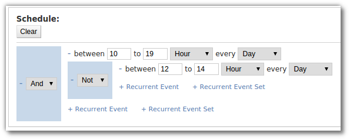

=====
Usage
=====

Look at :ref:`readme-schedule-model` before reading this.

Python
======
Python API contains two classes:
:py:class:`.RecurrentEvent` and
:py:class:`.RecurrentEventSet`.

Simple schedules via `ReccurrentEvent` class
--------------------------------------------

:py:class:`.RecurrentEvent` models simple schedules like
"from 10 to 19 hours of the day", "from 1 to 4 months of the year", etc.
For example this will define schedule "from first to sixth day of the week"::

   >>> from tempo.recurrentevent import RecurrentEvent
   >>> recurrentevent = RecurrentEvent(1, 6, 'day', 'week')

Then, we can perform queries - containment of a single date::

   >>> import datetime as dt
   >>> d1 = dt.datetime(2000, 1, 10)
   >>> d1.weekday()  # Monday - first day of the week
   0
   >>> d1 in recurrentevent
   True
   >>> d2 = dt.datetime(2000, 1, 14)
   >>> d2.weekday()  # Friday - fifth day of the week
   4
   >>> d2 in recurrentevent
   True
   >>> d3 = dt.datetime(2000, 1, 15)
   >>> d3.weekday()  # Saturday - sixth day of the week
   5
   >>> d3 in recurrentevent
   False

We also can query for further occurrences starting from certain point of time::

   >>> from itertools import islice
   >>> start = dt.datetime(2000, 1, 4)
   >>> start.weekday()  # Tuesday
   1
   >>> list(islice(recurrentevent.forward(start), 3))
   [(datetime.datetime(2000, 1, 4, 0, 0),
     datetime.datetime(2000, 1, 8, 0, 0)),
    (datetime.datetime(2000, 1, 10, 0, 0),
     datetime.datetime(2000, 1, 15, 0, 0)),
    (datetime.datetime(2000, 1, 17, 0, 0),
     datetime.datetime(2000, 1, 22, 0, 0))]

:py:meth:`.RecurrentEvent.forward` returns a generator,
that yields as largest possible interval each time. In this case it's a time
span between a Monday and a Saturday (non-inclusive) of each week.

Notice - `start` defines Tuesday, but our schedule starts on Monday - and
:py:meth:`~.RecurrentEvent.forward`, yielded the first
time interval, that starts on Tuesday, the time, that equals our `start`
argument.
It shrunk the first time interval by the `start`, since otherwise
the first time interval would be started from the time earlier, than `start`.
We can change this behavior, by passing additional argument `trim`::

   >>> list(islice(recurrentevent.forward(start, trim=False), 3))
   [(datetime.datetime(2000, 1, 3, 0, 0),
     datetime.datetime(2000, 1, 8, 0, 0)),
    (datetime.datetime(2000, 1, 10, 0, 0),
     datetime.datetime(2000, 1, 15, 0, 0)),
    (datetime.datetime(2000, 1, 17, 0, 0),
     datetime.datetime(2000, 1, 22, 0, 0))]

Now :py:meth:`.RecurrentEvent.forward` yielded largest possible interval not
only in future direction for the `start`, but also in past direction.

Composite schedules via `ReccurrentEventSet` class
--------------------------------------------------

Let's now take a look at :py:class:`.RecurrentEventSet`.
It makes possible to compose simple schedules to more complex ones, using
operators of union (`OR`), intersection (`AND`) and negation (`NOT`).

For example::

    >>> from tempo.recurrenteventset import RecurrentEventSet
    >>> recurrenteventset = RecurrentEventSet.from_json(
    ...     ('OR',
    ...         ('AND',
    ...             ('NOT', [12, 13, 'hour', 'day']),
    ...             ('AND', [1, 4, 'day', 'week'], [10, 19, 'hour', 'day']),
    ...             ('AND', [5, 6, 'day', 'week'], [10, 16, 'hour', 'day'])))
    ... )

That defines "from Monday to Thursday from 10am to 7pm and in Friday
from 10am to 4pm with the gap from 12am to 1pm".

:py:class:`.RecurrentEventSet` has the same interface as
:py:class:`.RecurrentEvent`: it provides :py:meth:`.RecurrentEventSet.forward`
and :py:meth:`.RecurrentEventSet.__contains__` methods, which has exactly
the same meaning as :py:class:`.RecurrentEvent` ones has.

.. note::
   Here, documentation uses :py:meth:`.RecurrentEventSet.from_json`,
   alternative constructor, it's because of convenience.
   :py:class:`.RecurrentEventSet` has also a regular constructor, which
   expects an `expression` of the same structure, but with
   :py:class:`.RecurrentEvent` instances instead of their JSON representations.

PostgreSQL
==========

The library provides domain types and functions, that represents library's
classes and their methods, which has similar to Python's methods signatures.

.. note::
   They are actually bindings to Python library, not implementations from
   scratch, that's why user required to have Python library installed and
   available for import from PL/Python procedures.

Currently only methods for :py:class:`.RecurrentEventSet` are supported.

Django
======

Querying
--------

.. omit::

   >>> getfixture('db')
   >>> getfixture('django_postgresql_tempo')

:py:class:`fields.RecurrentEventSetField` is a `Django model field`_.
It has adds no additional parameters, to the standard ones.
It supports a number of custom lookups:

  1. `contains` - tests a single ``datetime.datetime`` object for containment.
  2. `intersects` - tests a pair of ``datetime.datetime`` objects
     for intersection with a time defined by a schedule.
  3. `occurs_within` - tests some of time intervals, defined by a schedule,
     included in a boundaries, defined by a pair of ``datetime.datetime``
     objects.

Let's take movies as an example, and that's a Django model, that
describes a movie::

    from django.db import models
    from tempo.django.fields import RecurrentEventSetField

    class Movie(models.Model):
        name = models.CharField('Name', max_length=99)
        schedule = RecurrentEventSetField('Schedule')

        __str__ = __unicode__ = lambda self: self.name

.. omit::

   >>> from tests.test_django.aproject.anapp.models import Movie

Then, populate the database::

    >>> Movie.objects.create(name='Titanic',
    ...                      schedule=['OR', [11, 14, 'hour', 'day']])
    <Movie: Titanic>
    >>> Movie.objects.create(name='Lord of the Rings',
    ...                      schedule=['OR', [12, 15, 'hour', 'day']])
    <Movie: Lord of the Rings>
    >>> Movie.objects.create(name='Avatar',
    ...                      schedule=['OR', [18, 20, 'hour', 'day']])
    <Movie: Avatar>

With `contains` lookup, we can check, what movies a running in a certain
point of time, for example - in `2015-01-01 13:00`::

    >>> import datetime as dt
    >>> d = dt.datetime(2015, 1, 1, 13)
    >>> Movie.objects.filter(schedule__contains=d).order_by('name')
    [<Movie: Lord of the Rings>, <Movie: Titanic>]

With `intersects` lookup, we can find, what movies will be running in given
time period, for example - from `2015-01-01 14:00` to `2015-01-01 20:00`::

    >>> interval = (dt.datetime(2015, 1, 1, 14), dt.datetime(2015, 1, 1, 20))
    >>> Movie.objects.filter(schedule__intersects=interval).order_by('name')
    [<Movie: Avatar>, <Movie: Lord of the Rings>]

And with `occurs_within` lookup, we can find, what movies we can watch from
a start to an end in certain period of time, for example -
from `2015-01-01 10:00` to `2015-01-01 19:00`::

    >>> interval = (dt.datetime(2015, 1, 1, 10), dt.datetime(2015, 1, 1, 19))
    >>> Movie.objects.filter(schedule__occurs_within=interval).order_by('name')
    [<Movie: Lord of the Rings>, <Movie: Titanic>]

.. _`Django model field`: https://docs.djangoproject.com/en/1.8/topics/db/models/#fields

Using Django-Admin widget
-------------------------

Here is a minimal example::

    from django.contrib import admin
    from django import forms

    from myapp.models import Movie

    from tempo.django.forms import RecurrentEventSetField

    class MovieAdminForm(forms.ModelForm):
        schedule = RecurrentEventSetField()

        class Meta:
            model = Movie
            fields = ['name', schedule']

    class MovieAdmin(admin.ModelAdmin):
        form = MovieAdminForm

    admin.site.register(Movie, MyModelAdmin)

It will look like this:

Django-REST-Framework
=====================
Django REST Framework binding provides a `custom serializer field`_ -
:py:class:`.serializers.RecurrentEventSetField`. It's very simple and adds no
additional parameters. Just refer to DRF `serializers documentation`_ and use
this field like any other serializer field.

.. _`custom serializer field`: http://www.django-rest-framework.org/api-guide/fields/#custom-fields
.. _`serializers documentation`: http://www.django-rest-framework.org/tutorial/1-serialization/#creating-a-serializer-class
